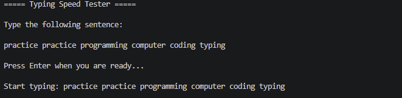
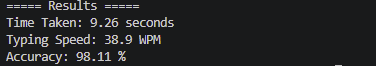
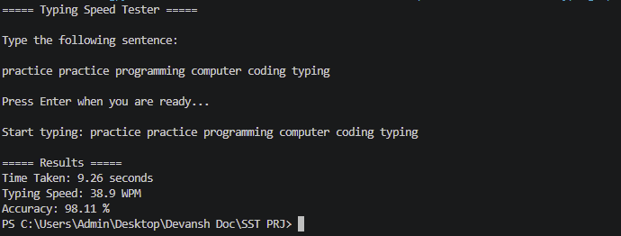

# Typing Speed Tester using Python

This is a beginner-friendly Python project that measures typing speed, typing accuracy, and time taken by the user.

The program dynamically generates random typing sentences using Python lists and the random module. Users type the generated sentence, and the program calculates their typing speed in words per minute (WPM) along with typing accuracy.

This project was built to practice Python fundamentals while creating an interactive and useful application.

---

## Features

- Generates random typing sentences
- Measures typing speed (WPM)
- Calculates typing accuracy
- Measures total time taken
- Beginner-friendly logic
- Interactive command-line interface

---

## Technologies Used

- Python
- time Module
- random Module

---

## Python Concepts Practiced

Through this project, I practiced:

- Variables
- Loops
- Conditional Statements
- Lists
- String Handling
- User Input
- Time Calculations
- Random Sentence Generation

---

## Project Structure

```bash
typing-speed-tester/
│
├── main.py
├── README.md
├── output.png
├── result.png
└── typing-test.png
```

---

## How to Run the Project

1. Install Python on your system
2. Download or clone this repository
3. Open the project folder
4. Run the following command:

```bash
python main.py
```

---

## How the Project Works

1. The program generates a random sentence
2. The user types the sentence
3. The timer starts when typing begins
4. The program calculates:
   - Time taken
   - Typing speed
   - Typing accuracy
5. Final results are displayed

---

## Example Output

```text
===== Typing Speed Tester =====

Type the following sentence:

technology coding improves projects typing logic

Start typing:
technology coding improves projects typing logic

===== Results =====

Time Taken: 8.21 seconds
Typing Speed: 43.85 WPM
Accuracy: 100%
```

---

# Screenshots

## Typing Test Screen



---

## Result Output



---

## Program Output



---

## Why I Built This Project

I built this project to improve my understanding of Python fundamentals while creating an interactive application. This project helped me practice loops, string handling, timing functions, lists, and random sentence generation in a practical way.

---

## Future Improvements

- Add difficulty levels
- Add multiplayer mode
- Store high scores
- Add graphical user interface (GUI)
- Add paragraph typing mode

---

## Author

Devansh Rajoura
